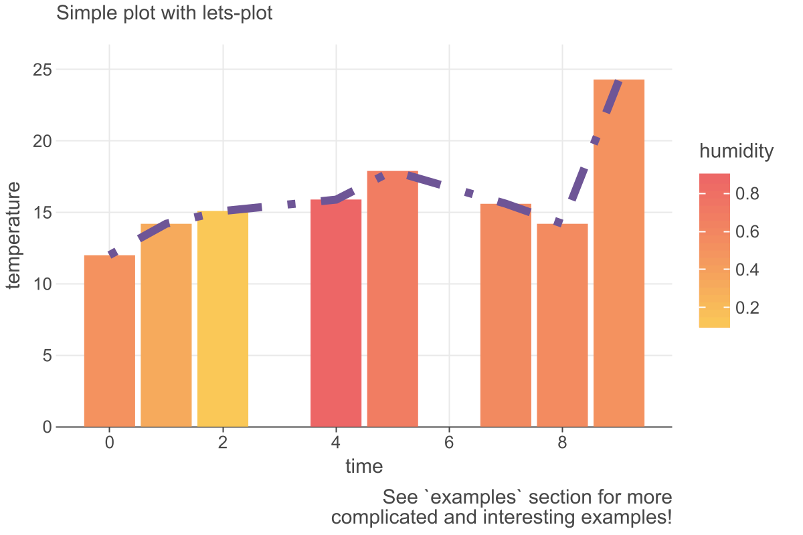
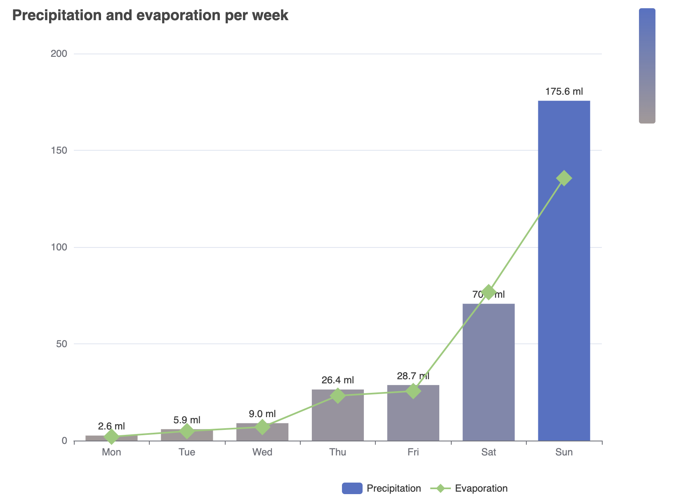

[](https://kotlinlang.org/docs/components-stability.html)
[](https://confluence.jetbrains.com/display/ALL/JetBrains+on+GitHub)
[](https://search.maven.org/artifact/org.jetbrains.kotlinx/kandy-api)
[](https://www.apache.org/licenses/LICENSE-2.0)

# Kandy

Kandy is an open-source plotting library for Kotlin
that provides a powerful and flexible DSL for creating graphs and utilizes various popular engines.

* Simplicity — provides an easy-to-use, simple and intuitive API,
  allowing users to quickly get started with creating visualizations.
* Flexibility — offers a wide range of options to implement diverse visualization requirements
* Readable — utilizes a concise DSL that provides a clear and concise representation of the constructed graph.
  The DSL is designed to be easy to understand and read, making it accessible to users of all levels of experience.
* Multi-engine — provides a common DSL that can be used with different well-known engines.
  This allows users to choose the engine that best suits their needs and preferences,
  without having to learn a new syntax.
* Typesafe — provides safe handling of various data types and supports Kotlin null safety,
  ensuring that users can work with their data in a secure and efficient manner.
* Data flexibility — seamlessly supports collections and [dataframe](https://github.com/Kotlin/dataframe#readme),
  enabling users to work with a wide range of data formats in their visualizations.

Inspired by [The Grammar of Graphics](https://www.goodreads.com/book/show/2549408.The_Grammar_of_Graphics).

### Quickstart

Inside [Kotlin Notebook](https://plugins.jetbrains.com/plugin/16340-kotlin-notebook),
[Datalore](https://datalore.jetbrains.com/)
or [Jupyter with Kotlin Kernel](https://github.com/Kotlin/kotlin-jupyter#readme):

```kotlin
%use kandy

    plot {
        bars {
            x(listOf("first", "second", "third"))
            y(listOf(7, 3, 5))
        }
    }
```

## Table of contents

<!--- TOC -->

* [Overview](#overview)
* [Examples](#examples)
    * [Lets-Plot](#lets-plot)
    * [Echarts](#echarts)
* [Using Kandy](#using-kandy)
* [Contributing](#contributing)
* [Code of Conduct](#code-of-conduct)
* [License](#license)

<!--- END -->

## Overview

Kandy is a Kotlin library that provides a flexible and idiomatic DSL for creating various types of charts,
leveraging different visualization libraries.
The library aims
to make it easy and quick for users to create both basic and complex charts with many parameters and settings,
without the need for lengthy documentation.
Depending on the task, users can choose from different engines for the perfect visualization.

Kandy integrates with [dataframe](https://github.com/Kotlin/dataframe#readme),
another Kotlin library for working with data, allowing for a seamless transition from data processing to final
visualization.
Additionally,
integration with `kandy-lets-plot` in [Kotlin Notebook](https://plugins.jetbrains.com/plugin/16340-kotlin-notebook)
enables high-speed chart rendering and the ability to work with large amounts of data without delays or waiting.

The library comprises the following modules:

* `kandy-api` — This module provides a simple-to-use API for creating charts.
* `kandy-lets-plot` — This module offers an implementation of
  the [Lets-Plot](https://github.com/JetBrains/lets-plot#readme) library,
  which is based by Leland Wilkinson
  work [The Grammar of Graphics](https://www.goodreads.com/book/show/2549408.The_Grammar_of_Graphics)
  and is a proven tool for creating visualizations.
* `kandy-echarts` — This module provides an implementation of
  the [Apache ECharts](https://echarts.apache.org/en/index.html) library,
  which is a widely-used tool for creating interactive visualizations.

## Examples

### Lets-Plot

```kotlin
val simpleDataset = mapOf(
    "time" to listOf(0, 1, 2, 4, 5, 7, 8, 9),
    "temperature" to listOf(12.0, 14.2, 15.1, 15.9, 17.9, 15.6, 14.2, 24.3),
    "humidity" to listOf(0.5, 0.32, 0.11, 0.89, 0.68, 0.57, 0.56, 0.5)
)

plot(simpleDataset) {
    x("time"<Int>())

    y("temperature"<Double>()) {
        scale = continuous(0.0..25.5)
    }

    bars {
        fillColor("humidity"<Double>()) {
            scale = continuous(range = Color.YELLOW..Color.RED)
        }
        borderLine.width = 0.0
    }

    line {
        width = 3.0
        color = Color.hex("#6e5596")
        type = LineType.DOTDASH
    }

    layout {
        title = "Simple plot with lets-plot"
        caption = "See `examples` section for more\n complicated and interesting examples!"
    }

}
```



> You can get this example as a [notebook](examples/notebooks/lets-plot/simple_lets_plot.ipynb) or as
> a [Kotlin project](examples/idea-examples/lets-plot-simple/src/main/kotlin/org/jetbrains/kotlinx/kandy/letsplot/simple_lets_plot.kt).

### ECharts

```kotlin
val dataset = mapOf(
    "days_of_week" to listOf("Mon", "Tue", "Wed", "Thu", "Fri", "Sat", "Sun"),
    "evaporation" to listOf(2.0, 4.9, 7.0, 23.2, 25.6, 76.7, 135.6),
    "precipitation" to listOf(2.6, 5.9, 9.0, 26.4, 28.7, 70.7, 175.6),
    "temp" to listOf(2.0, 2.2, 3.3, 4.5, 6.3, 10.2, 20.3)
)

plot(dataset) {
    x("days_of_week"<String>())

    bars {
        name = "Precipitation"
        y("precipitation"<Double>()) { scale = continuous(0.0..200.0) }
        color("temp"<Double>()) { scale = continuous(range = Color.GREY..Color.BLUE) }
        label {
            position = LabelPosition.TOP
            formatter = "{@precipitation} ml"
        }
    }

    line {
        name = "Evaporation"
        y("evaporation"<Double>())
        symbol = Symbol.diamond(20.0)
    }

    layout {
        title.text = "Precipitation and evaporation per week"
        legend {
            left = 50.pct
            bottom = 0.px
        }
    }
}
```



> You can get this example as a [notebook](examples/notebooks/echarts/simple_echarts.ipynb) or as
> a [Kotlin project](examples/idea-examples/echarts-simple/src/main/kotlin/org/jetbrains/kotlinx/kandy/echarts/simple_echarts.kt).

More examples of working with the library can be found [here](examples/README.md).

## Using Kandy

### Kotlin Notebook, Datalore, Kotlin Jupyter Notebook

You can use Kandy in Kotlin-supported notebooks,
namely in [Kotlin Notebook](https://plugins.jetbrains.com/plugin/16340-kotlin-notebook),
[Datalore](https://datalore.jetbrains.com/),
and [Kotlin Jupyter Notebook](https://github.com/Kotlin/kotlin-jupyter#readme).

You can include all the necessary dependencies and imports in the notebook using *line magic*:

```
%use kandy
```

You can use `%useLatestDescriptors`
to get the latest stable version without updating the Kotlin kernel or manually specify the version:

```
%useLatestDescriptors
%use kandy
```

or

```
%use kandy($kandy_version)
```

Refer to the [documentation on *"line magic"*](https://github.com/Kotlin/kotlin-jupyter#line-magics) for details.

Available descriptors:

* `kandy` — includes an API, implementation of Lets-Plot, DSL features, and DataFrame support
* `kandy-echarts` — includes an API, implementation of ECharts, DSL features, and DataFrame support

### Gradle

Add dependencies (you can also add other modules that you need):

```kotlin
dependencies {
    implementation("org.jetbrains.kotlinx:kandy-lets-plot:$kandy_version")
}
```

Make sure that you have `mavenCentral()` in the list of repositories:

```kotlin
repositories {
    mavenCentral()
}
```

## Contributing

Read the [Contributing Guidelines](CONTRIBUTING.md).

## Code of Conduct

This project and the corresponding community are governed by the
[JetBrains Open Source and Community Code of Conduct](https://confluence.jetbrains.com/display/ALL/JetBrains+Open+Source+and+Community+Code+of+Conduct).
Please make sure you read it.

## License

Kandy is licensed under the [Apache 2.0 License](LICENSE).
